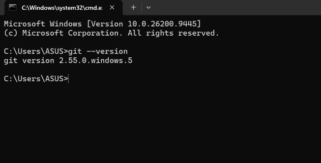
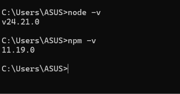
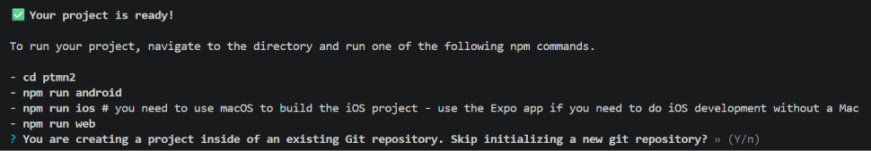

# Praktikum Menyiapkan Lingkungan Pengembangan dan Memulai Pemrograman Mobile React Native #

## Tujuan Pembelajaran ##
Mahasiswa Mampu:
1. Menyiapkan lingkungan pngembangan dan memulai pemrograman mobile (React Native)
2. Membuat Aplikasi Mobile dengan React Native
3. Menyelesaikan Tugas CV sederhana dengan React Native

## Materi dan Laporan Praktikum ##
1. Menyiapkan lingkungan pngembangan dan memulai pemrograman mobile (React Native)
    - Memastikan instalasi Git bash
        - Cek Instalasi Git bash (git --version)
        - Bukti Verifikasi
        

    - Memastikan Node.JS dan NPM
        - Download dan Install Nod.JS
        - Konfigurasi Node.JS dan NPM (node -v, npm -v)
        

2. Membuat Aplikasi atau Project baru dengan React Native Framwork Expo Go
    - Buka dan baca dokumentasi resmi link https://reactnative.dev/docs/getting-started
    - Buka dan baca dokumentasi resmi link https://docs.expo.dev/ 
    - Memulai membuat Project baru 
    - Change directory ke Pertemuan-2
    - masukkan perintah (npx create-expo-app ptmn2 --template blank)
    - bukti verifikasi
    
    - Running Project
        - cd ptmn2
        - npx expo start
        - install expo go di Android atau IOS
        - bisa juga memakai web emulator di pc/Laptop
        - setelah itu berhentikan (ctrl+c)
        - install (npx expo install react-dom react-native-web)
        - npx expo start --web
        konfirmasi keberhasilan
        

3. Membuat CV Sederhana dengan React Native
    - Nama
    - NIM
    - Asal Sekolah
    - Cita-cita
    - Rencana Menggapai cita-cita

