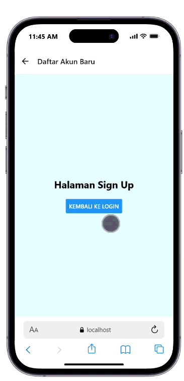
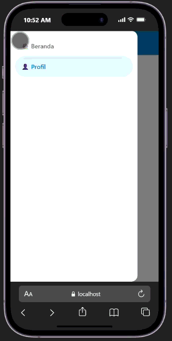

# Praktikum 4 React Native Navigation #

## Tujuan Pembelajaranan ##
Mahasiswa Mampu:
1. Merancang dan Menerapkan navigasi antar layar (screen) pada aplikasi react native
2. Menggunakan library React Navigation (stack navigator, Tab Navigator, Drawer Navitagor)

## Alur Praktikum ##

### Langkah 1: Inisiasi Proyek React Native ##
1. Buka terminal atau cmd
2. ubah directory ke folder pertemuan-4 
3. buat proyek baru menggunkan perintah npx create-expo-app ptmn4 --template blank
4. masuk kedalam folder proyek dengan cd ptmn4
5. npm install @react-navigation/native
6. npx expo install react-native-screens react-native-safe-area-context react-native-gesture-handler react-native-reanimated

### Langkah 2: Membuat Stack Navigator ###
1. Instalasi Pustaka Stack Jalankan perintah berikut di terminal: npm install @react-navigation/native-stack
2. Membuat Folder (screens)
3. buat file Login.js dan Signup.js
4. masukan kode dari modul
5. sesuaikan app.js seperti modul
6. simpan dan install dependency untuk web npx expo install react-dom react-native-web 
7. jalankan npx expo-start
8. konfirmasi bukti

### Langkah 3: Implementasi Bottom Tab Navigator ###
1. Instalasi Pustaka Bottom Tab Navigator dengan npm install @react-navigation/bottom-tabs
2. Membuat halaman beranda 
3. membuat halaman profile
4. konfigurasikan di app.js

<video controls src="20261003-0718-02.6047617.mp4" title="Implementasi bottom navigator" width="15%"></video>

